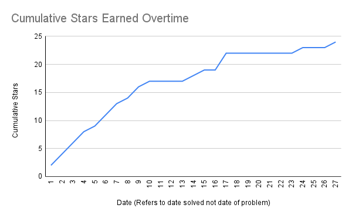

# 2023

First time participating, using it as a way to improve my Python skills.

Problems are in folders named by the day e.g. 1 is December 1st.

Part one has a topical label based on the story e.g. `oasis.py` and part two is `oasis2.py`

Provided test data in `test.txt` and actual data in `input.txt`
Can run problems like following: 
```bash
python oasis.py input.txt
```
Can run pytest in folders with test files (.py that start with test), in those folders `test.txt` is used if no name is provided.

1-10 inclusive are finished as well as day 16 and part 1 for days 14 and 15 for a total of 24 stars.


Environment Setup Instructions (note: python is an alias for python3):
```bash
cd 2023
python -m venv advent
source advent/bin/activate
pip install pydantic
pip install pytest
```